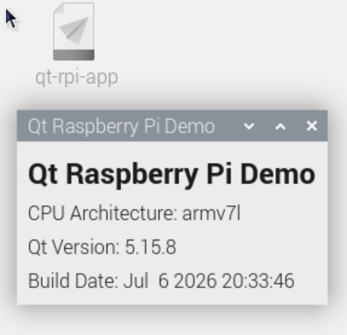

### Dependencies
Docker Desktop
VS Code
Raspberry Pi


### Dir structure

```bash
- qt-rpi-docker
--app
---forms
---src
--build
--output
Dockerfile
build.sh
```


## Starting compilation script
```bash
cd qt-rpi-docker
./build.sh
```


### Copy the compiled app to output dir
```bash
cp qt-rpi-app ../output/
```

### Проверка приложения на Raspberry Pi
The app has been tested on Raspberry Pi Zero with Raspberry Pi OS (Legacy, 32-bit).

Install pi OS via Raspberry Pi Imager with user/pass credentials

Use rpi-connect to connect to the pi board in case user has no access to monitor, keyboard, and mouse

### How to find ip address of rapberry pi
```bash
ping host.local

ssh user@ip
```

```bash
# Install dependencies for raspberry pi
sudo apt update && sudo apt upgrade -y

sudo apt install rpi-connect

rpi-connect on

sudo iwconfig wlan0 power off

sudo reboot 0

rpi-connect signin (https://www.raspberrypi.com/software/connect/)

# Copy app from docker to raspberry pi
scp output/qt-rpi-app user@ip:~

# Launch qt-rpi-app to test

```

